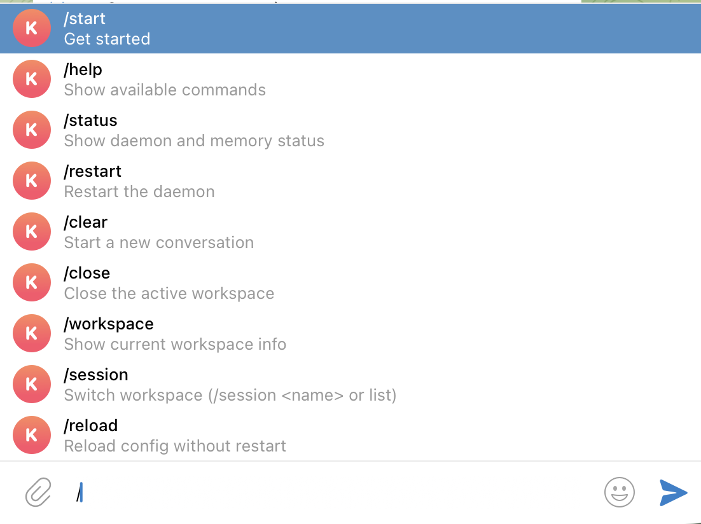

# relay

**A persistent AI familiar — text your agent on Telegram, it works in your codebase.**

relay is a lightweight C daemon that routes Telegram messages to Claude Code (or Gemini, or OpenAI Codex) running on your machine. Configure workspaces, switch between them like browser tabs, and your agent picks up exactly where you left off.

No cloud infrastructure. No web UI. Just a process on your machine and your Telegram app.

---

## Quick Start

```bash
git clone git@github.com:rawphp/relay.git
cd relay
./install.sh
```

The installer asks for a name, your Telegram credentials, and your first workspace. It builds the daemon, creates the runtime directory, and writes your config. Done in under two minutes.

→ **[Full installation guide](https://rawphp.github.io/relay/user/install)**

---

## How It Works

```
You (Telegram)  →  relay daemon  →  Claude Code subprocess  →  You (Telegram)
```

Send a message. The daemon routes it to Claude Code in your active workspace, streams the response back to Telegram, and saves the session so the conversation continues next time.

---

## Features

| | |
|---|---|
| **Multi-workspace** | Configure any number of project directories and switch between them from Telegram |
| **Per-workspace providers** | Use Claude for one project, Codex for another, Gemini for a third |
| **Persistent sessions** | Conversations survive daemon restarts — picks up where you left off |
| **Identity files** | Give your agent a personality, goals, and memory that persist across sessions |
| **Memory system** | Optional semantic search over past conversations — relevant context injected automatically |
| **Agent bus** | Multiple relay agents can message each other via Unix socket |
| **No cloud** | Runs entirely on your machine — only outbound connections are to Telegram and your LLM |

---

## Telegram Commands



| Command | Description |
|---------|-------------|
| `/session <name>` | Switch to a named workspace |
| `/sessions` | List all configured workspaces |
| `/workspace` | Show current workspace, path, and provider |
| `/clear` | Start a fresh conversation |
| `/status` | Daemon health and memory sidecar status |
| `/reload` | Reload config without restarting |
| `/restart` | Restart the daemon |
| `/help` | Show all commands |

---

## Requirements

- macOS or Linux
- Xcode Command Line Tools or gcc
- `curl`
- At least one LLM CLI, installed and authenticated:
  - [Claude Code](https://claude.ai/code): `npm install -g @anthropic-ai/claude-code`
  - [OpenAI Codex](https://github.com/openai/codex): `npm install -g @openai/codex`
  - [Gemini CLI](https://github.com/google-gemini/gemini-cli): `npm install -g @google/gemini-cli`
- A Telegram bot token — [@BotFather](https://t.me/BotFather)
- Your Telegram user ID — [@userinfobot](https://t.me/userinfobot)

---

## Documentation

| | |
|---|---|
| [Installation & Configuration](https://rawphp.github.io/relay/user/install) | Prerequisites, install.sh, relay.conf reference |
| [Operations](https://rawphp.github.io/relay/user/operations) | CLI commands, updating, multi-agent setup |
| [Identity Files](https://rawphp.github.io/relay/user/identity) | Customizing your agent's personality and memory |
| [Architecture](https://rawphp.github.io/relay/developer/architecture) | How the daemon works internally |
| [Development Guide](https://rawphp.github.io/relay/developer/development) | Building, testing, and extending relay |

---

## Updating

```bash
cd relay
git pull
./update.sh
```

Rebuilds the binary, redeploys to all registered agents, restarts. Config, identity files, sessions, and transcripts are never touched.

---

## License

MIT
